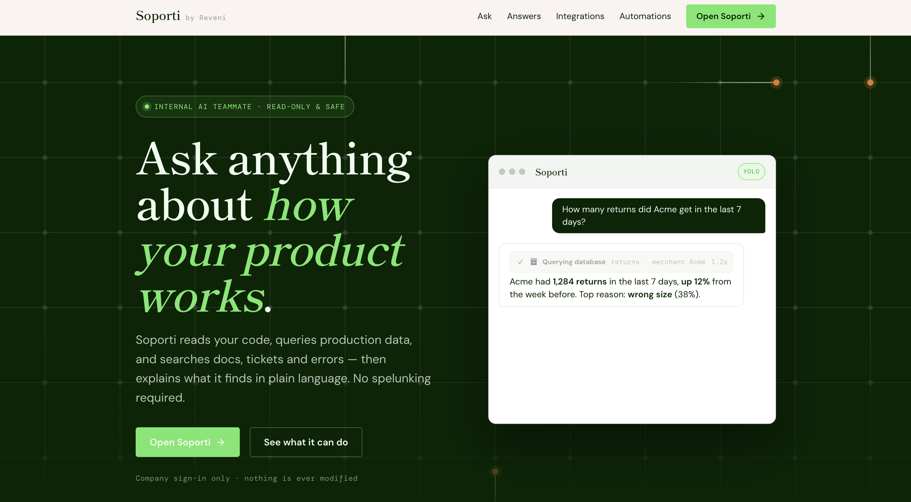
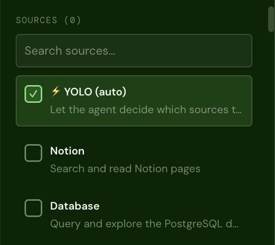
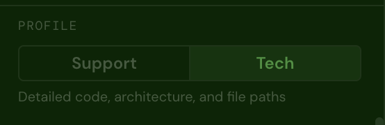

# Soporti

[](https://github.com/reveni-io/soporti/actions/workflows/ci.yml) [](https://github.com/reveni-io/soporti/actions/workflows/codeql.yml) [](LICENSE) 

AI-powered code assistant that helps support and engineering teams understand and navigate code repositories. Built with OpenAI's Agent SDK and a React chat interface.



[](https://cloud.digitalocean.com/apps/new?repo=https://github.com/reveni-io/soporti/tree/main) [](https://render.com/deploy?repo=https://github.com/reveni-io/soporti)

One-click deploys for DigitalOcean App Platform and Render — see the [deployment guide](docs/deployment.md#one-click-deploys).

## Features

- **AI Chat with Tool Calling** — Ask questions about your codebase and get answers powered by OpenAI agents that can browse files, search code, and explore directory structures
- **Admin-managed auth** — Email/password sign-in plus optional Google Sign-In (restrictable to your email domains); users are created from the admin panel and persisted in PostgreSQL
- **Zero-config-file setup** — Credentials and integrations are configured from the `/admin` panel and stored in the database; booting needs only `JWT_SECRET` and `DATABASE_URL`
- **Multiple Integrations** — Connect GitHub, Notion, PostgreSQL, Sentry, Shortcut, Slack, Google Drive, Helpjuice, and Shopify
- **Response Profiles** — Switch between "tech" (detailed, code-heavy) and "support" (simplified, behavior-focused) modes
- **Real-time Streaming** — Server-Sent Events for live response streaming
- **Rich Rendering** — Markdown, syntax highlighting, Mermaid diagrams (rendered as SVG), and Recharts-based charts
- **Slack Bot** — Interact with the assistant directly from Slack via @mentions
- **Shareable Conversations** — Generate read-only links to share chat sessions

| Choose your sources | Switch response profiles |
| --- | --- |
|  |  |

## Architecture

```
soporti/
├── client/          # React 19 + Vite
├── server/          # Express + OpenAI Agents SDK
└── package.json     # Root coordinator
```

**Server** — Express app with OpenAI Agent SDK integration, SSE streaming, shallow git clone pool with LRU eviction, and conditional tool registration based on configured integrations.

**Client** — React 19 SPA with chat interface, sidebar for repo/profile selection, and specialized renderers for code blocks, diagrams, and charts.

## Prerequisites

- Node.js 20+ (or Docker + Docker Compose for the containerized setups)
- Git
- A PostgreSQL database (provided automatically by Docker Compose — see below)
- An OpenAI API key — configured from the `/admin` panel after the first boot, not an env var

Optional, also configured from `/admin` later: a GitHub Personal Access Token, a Google OAuth Client ID for Google sign-in, Slack/Notion/Google Drive/Helpjuice credentials.

## Quick Start

1. **Clone and install**

```bash
git clone https://github.com/reveni-io/soporti.git
cd soporti
npm run install:all
```

2. **Configure environment**

```bash
cp .env.example .env
```

Edit `.env` and fill in the required values:

| Variable | Required | Description |
|---|---|---|
| `DATABASE_URL` | Yes | PostgreSQL connection string for the app database (users, config) |
| `JWT_SECRET` | Yes | Secret used to sign session JWTs (e.g. `openssl rand -hex 32`) |
| `VITE_GOOGLE_CLIENT_ID` | No | Google OAuth Client ID, baked into the client build — only if you enable Google sign-in |
| `JWT_EXPIRES_IN` | No | Session lifetime (default: `24h`) |
| `CORS_ORIGIN` | No | Allowed browser origins (CSV) — set it when the client is served from a different domain than the API |

Everything else — the OpenAI API key and model, the GitHub token and repository catalog, Slack, Notion, Google Drive, Helpjuice, the agent's read-only query database, Shopify, sign-in methods and allowed Google domains — is **not** an env var: it lives in the database and is managed from the admin panel (`/admin`) after the first-run setup.

3. **Start development**

The fastest path is Docker Compose, which brings up PostgreSQL, the server, and the client with one command:

```bash
npm run docker:up
```

This starts PostgreSQL, the server (port 3001), and the client (port 5173) with hot-reload. Database migrations (Drizzle) are applied automatically on server boot, so the schema is ready on first run. Open http://localhost:5173. Stop everything with `npm run docker:down`.

> If you ran an earlier version of this stack before migrations existed, reset the dev database once so Drizzle owns the schema: `docker compose down -v` (this drops the `pgdata` volume), then `npm run docker:up`.

Alternatively, run the server and client directly on your machine (you must provide your own PostgreSQL via `DATABASE_URL`):

```bash
npm run dev
```

This starts both the server (port 3001) and client (port 5173) concurrently. Open http://localhost:5173.

### First run

1. Boot the app. With no admin user yet, the server prints a **one-time setup code** in its logs.
2. Open `/admin`, enter the setup code and create the first admin (email + password).
3. In `/admin` → OpenAI, set the API key and model (there is no default model — the chat won't run until both are set).
4. Configure any integrations you want from the panel, and create regular users in `/admin` → Users (there is no self-registration).

### Set up Google Sign-In (optional)

Google sign-in is **off by default** on fresh installs; password sign-in is on.

1. In the [Google Cloud Console → Credentials](https://console.cloud.google.com/apis/credentials), create an **OAuth 2.0 Client ID** of type **Web application**.
2. Under **Authorized JavaScript origins**, add `http://localhost:5173` (and your production origin).
3. Copy the generated Client ID into `VITE_GOOGLE_CLIENT_ID` in `.env` (it is baked into the client build), save the same value in `/admin` → Authentication, and enable the Google method there.

The allowed Google domains are configured in `/admin` → Authentication (an empty list allows any verified Google account).

## Scripts

| Command | Description |
|---|---|
| `npm run dev` | Start server + client in dev mode (needs your own PostgreSQL) |
| `npm run docker:up` | Start PostgreSQL + server + client in Docker (dev) |
| `npm run docker:down` | Stop the Docker dev stack |
| `npm run docker:prod` | Build + start the production stack (`docker-compose.prod.yml`) |
| `npm run docker:prod:down` | Stop the production stack |
| `npm run install:all` | Install dependencies for both packages |
| `npm run build:client` | Build client for production |
| `npm test` | Run all tests (server + client) |
| `npm run test:coverage` | Run all tests with coverage reports |
| `npm run dev --prefix server` | Server only |
| `npm run dev --prefix client` | Client only |

## Testing

The project uses [Vitest](https://vitest.dev/) for both server and client. All external services are mocked — tests run fast with no external dependencies.

```bash
# Run all tests
npm test

# Run with coverage
npm run test:coverage

# Run only server or client tests
npm test --prefix server
npm test --prefix client

# Watch mode
npm run test:watch --prefix server
npm run test:watch --prefix client
```

### Server test tiers

- **Pure functions** — `sanitize`, `formatter`, `system-prompt`
- **Core business logic** — `auth`, `sessions`, `shares`, `repo-pool`
- **External API clients** — GitHub, Notion, PostgreSQL, Sentry, Shortcut (all mocked)
- **Route integration** — supertest-based tests for all Express endpoints including SSE streaming
- **Agent & Slack** — agent factory, tool registration, Slack session mapping and message handling

### Client tests

- **Hooks** — `useAuth` (login/logout/token persistence), `useChat` (SSE streaming, message state, abort)
- **Components** — Login, Chat, Message, Sidebar, ToolCall, ShareModal, SharedView, ChartBlock, MermaidDiagram
- **Integration** — App-level tests covering auth flow, repo selection, and share modal

## Optional Integrations

All integrations are conditionally loaded — tools are only registered with the agent if the integration is configured. They are configured from the `/admin` panel (stored in the database, no restart needed); only a few operational tunables remain env vars.

### Configured from `/admin`

- **GitHub** — token, repository catalog, and the PR-review webhook secret (`/admin` → GitHub). Powers repo browsing and automated PR reviews.
- **Notion** — integration token (`/admin` → Notion). Create one at [notion.so/my-integrations](https://www.notion.so/my-integrations) and share the relevant pages with it.
- **Database (agent query tool)** — a read-only PostgreSQL connection string plus a query row cap (`/admin` → Database). This is a **separate** database from the app's own `DATABASE_URL`: it's the customer database the agent explores with schema and SELECT-only tools.
- **Shopify** — rides on that query database: an admin-written SQL template resolves a store identifier to its Shopify domain + Admin API token (`/admin` → Shopify, with a "Draft with Soporti" helper that explores your schema).
- **Google Drive** — a read-only service-account JSON key (`/admin` → Google Drive). Access is governed by Drive sharing: share each folder with the service-account email as Viewer.
- **Helpjuice** — API key + account subdomain (`/admin` → Helpjuice).
- **Shortcut** — API token (`/admin` → Shortcut). Generate one in Shortcut under **Settings → Your Account → API Tokens**. Powers story lookups and the spec axis of PR reviews.
- **Sentry** — auth token + organization slug (`/admin` → Sentry). Create a token at [sentry.io/settings/auth-tokens](https://sentry.io/settings/auth-tokens/). Fetches issue details with stacktraces and searches issues by error message.
- **Slack bot** — bot token, app token and signing secret (`/admin` → Slack); the bot (re)connects in place when they are saved. Uses Socket Mode (no public URL required). Create a Slack app at [api.slack.com/apps](https://api.slack.com/apps) with scopes: `app_mentions:read`, `chat:write`, `channels:history`, `im:history`, `im:read`.

### Configured via env vars

A handful of operational tunables (not integration credentials) are still read from `.env`.

#### Slack ticket auto-diagnose (optional)

```env
SLACK_AUTODIAGNOSE_LIST_ID=F0XXXXXXX
# SLACK_AUTODIAGNOSE_COLUMN_NAME=Diagnosis
```

Soporti can auto-triage support tickets filed in a channel via a request-form workflow that stores each ticket as an item in a [Slack List](https://slack.com/help/articles/27452748828179-Use-lists-in-Slack). It polls the List, and for every item whose diagnosis column is still empty it reads the ticket (and any screenshots), runs an autonomous diagnosis with the full support toolset, and writes the result — preliminary diagnosis, proposed fixes if it looks like a bug, and a recommendation for support — back into that column. Enabled only when `SLACK_AUTODIAGNOSE_LIST_ID` is set. One-time setup: add the bot scopes `lists:read`, `lists:write`, `files:read` and reinstall the app; give the bot access to the List; add a Text column named like `SLACK_AUTODIAGNOSE_COLUMN_NAME` (the empty column doubles as the "not yet diagnosed" marker, so a diagnosis is never duplicated and tickets survive restarts). To avoid diagnosing the whole historical backlog on first activation, archived tickets are always skipped and you can set `SLACK_AUTODIAGNOSE_SKIP_BEFORE` to the go-live timestamp so only tickets created after it are diagnosed. Posting the diagnosis as a list-item *comment* is not possible — the Slack Lists API has no comment-write method — so the diagnosis lands in a field.

## App database (Drizzle ORM)

The app's own data (the `users` table) lives in the database pointed to by `DATABASE_URL`, managed with [Drizzle ORM](https://orm.drizzle.team/). The schema is defined in `server/src/db/schema.js` and migration SQL is committed under `server/drizzle/`. The server applies pending migrations on boot.

After changing the schema, regenerate the migration:

```bash
npm run db:generate --prefix server   # create a new migration from the schema
npm run db:migrate --prefix server     # apply migrations to DATABASE_URL (optional; the server also does this on boot)
npm run db:studio --prefix server      # browse the database in Drizzle Studio
```

## Docker

### Development (recommended)

`docker-compose.yml` runs the full stack — PostgreSQL, server, and client — with hot-reload, using `server/Dockerfile.dev` and `client/Dockerfile.dev`:

```bash
npm run docker:up     # build + start everything
npm run docker:down   # stop
```

Postgres data persists in the `pgdata` volume. To inspect the users table:

```bash
docker compose exec db psql -U soporti -d soporti -c 'select email, last_login_at from users;'
```

### Production

`docker-compose.prod.yml` runs the full production stack — PostgreSQL, the server, and the built client served by nginx (which proxies `/api` to the server, so everything shares one origin). The only required setting is `JWT_SECRET`:

```bash
cp .env.example .env    # set JWT_SECRET (openssl rand -hex 32)
npm run docker:prod     # open http://localhost:8080, then follow the first-run flow
npm run docker:prod:down
```

The standalone production images (`server/Dockerfile`, `client/Dockerfile`) can also be deployed separately — e.g. the client as a static site and the server as a container on a PaaS. See [docs/deployment.md](docs/deployment.md) for the full guide: first-run flow, environment reference, split deployments, and operational notes.

Prefer a hosted setup? The **Deploy to DigitalOcean** and **Deploy to Render** buttons at the top of this README provision the whole stack (server, client, PostgreSQL) from [`.do/deploy.template.yaml`](.do/deploy.template.yaml) and [`render.yaml`](render.yaml) respectively — see [One-click deploys](docs/deployment.md#one-click-deploys).

## Tech Stack

**Server:** Express, OpenAI Agents SDK, Octokit, Slack Bolt, pg, Zod, Helmet

**Client:** React 19, Vite, React Markdown, React Syntax Highlighter, Recharts, remark-gfm

## Security

Soporti is an LLM agent with read access to real systems — before connecting a production database, Drive, or Slack, read [SECURITY.md](SECURITY.md): it explains the security model, the deliberately accepted risks, and a hardening checklist. Vulnerabilities are reported through GitHub's private vulnerability reporting, not public issues.

## Contributing

See [CONTRIBUTING.md](CONTRIBUTING.md). This project follows the [Contributor Covenant Code of Conduct](CODE_OF_CONDUCT.md).

## License

[Apache License 2.0](LICENSE)
