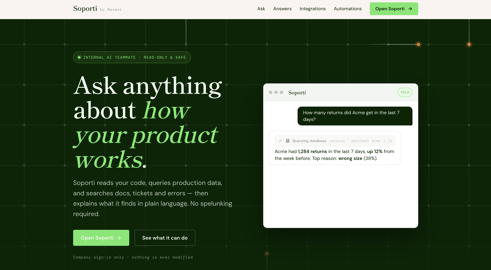
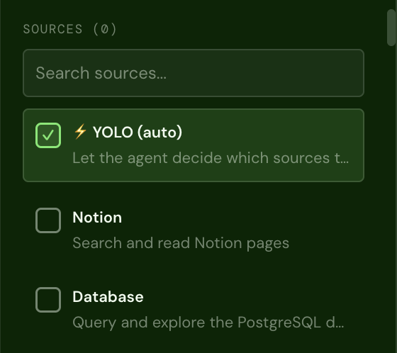
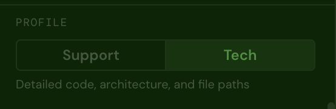

# Soporti

[](https://github.com/reveni-io/soporti/actions/workflows/ci.yml) [](https://github.com/reveni-io/soporti/actions/workflows/codeql.yml) [](LICENSE) 

AI-powered code assistant that helps support and engineering teams understand and navigate code repositories. Built on the OpenAI Agents SDK — running against OpenAI or Anthropic, your choice — with a React chat interface.

**[soporti.reveni.com](https://soporti.reveni.com)** — see what it looks like before installing it.

[](https://soporti.reveni.com)

[](https://cloud.digitalocean.com/apps/new?repo=https://github.com/reveni-io/soporti/tree/main) [](https://render.com/deploy?repo=https://github.com/reveni-io/soporti)

One-click deploys for DigitalOcean App Platform and Render — see the [deployment guide](docs/deployment.md#one-click-deploys).

## Features

### Ask across your stack

Every integration is optional and configured from the `/admin` panel — the assistant only gets tools for what you connect ([setup details](#optional-integrations)). Granola is the exception: each user connects their own account from **Settings → Connections**.

| Source | What the assistant can do |
|---|---|
| **GitHub** | Browse repositories and directories, read files, search code by content, find files by name, and trace a file's history with `git log` / `git blame` |
| **Database** | Explore schemas and tables, then answer with real data through read-only, row-capped `SELECT`s |
| **Shortcut** | Read a story by ID or search stories — what was specced versus what shipped |
| **Sentry** | Open an issue with its stacktrace, or find issues by error message |
| **Better Stack** | Search the application logs by text and time range, or aggregate them with read-only ClickHouse SQL (counts per level, errors per endpoint) |
| **Notion** | Search and read the pages shared with the integration |
| **Google Drive** | Search, list and read shared folders — Docs, Sheets, Slides, PDFs and Office files |
| **Helpjuice** | Search and read your help center articles |
| **Granola** | Search and read **your own** meeting notes — connected per user, so nobody reaches anyone else's (web and MCP only, not Slack) |
| **Shopify** | Look up orders, products and webhooks store by store, or run read-only Admin GraphQL queries |
| **Slack** | Ask the assistant from Slack, in a thread, with an @mention — the reply is a live card showing each source it opens as it happens, with the answer streaming in underneath |

### Make it answer your way

- **Pick the sources per conversation** — scope a chat to the repos and integrations it may use, or go YOLO and give it everything. The selection is enforced when the tools are built, not just requested in the prompt
- **Attach documents and images to a message** — drag up to 3 files (`.pdf`, `.docx`, `.xlsx`, `.png`, `.jpg`, `.webp`, `.gif`, max 10 MB each) onto the composer, pick them with the paperclip, or paste a screenshot straight from the clipboard with `Cmd+V`. A document's text is extracted and given to the assistant as context, and a document longer than 50,000 characters is truncated and the message says so. An image is sent to the model as an image — a screenshot of an error or a photo of a broken screen is read, not described. Images above what the model accepts (7 MB, or 8000 px on the long edge) are downscaled in the browser before upload, so you can attach the photo as it came off your phone. Each image is stored for 30 days (`CHAT_IMAGE_RETENTION_DAYS`) so a reloaded conversation still shows its thumbnail, after which the chip falls back to a placeholder. Attachments belong to their conversation only: they are not indexed into the knowledge base, are not visible from other chats, and their file names and images are hidden from read-only share links
- **Response profiles** — *support* (plain language, behavior-focused) or *tech* (detailed, code-heavy) for the same question
- **Custom instructions** — your role, your language, your preferred level of detail, applied to every chat automatically
- **Skills (`/commands`)** — save reusable instruction snippets (a triage checklist, a review rubric, a tone of voice) and run one by starting a message with `/skill-name`, with autocomplete as you type `/`. The skill stays active for the rest of that conversation, its instructions take precedence over the default style rules, and `$ARGUMENTS` / `$1…$9` slot in what you typed after the command. Create and edit them in **Settings → Skills**
- **Artifacts** — when the answer is a deliverable rather than a chat reply — an incident report, a runbook, a migration guide, or something you operate like a dashboard over a query or an explorer you can filter — the assistant builds it as a self-contained page and opens it in a panel beside the conversation, with a card in the chat to reopen it. It runs your queries first and bakes the results in, so the page needs no backend of its own. Ask for a change and it publishes a new version you can switch between from the panel header, with the previous ones kept. The page is rendered in a sandboxed iframe on an opaque origin: it cannot read your session, your token or your cookies, cannot touch the app around it, and a Content-Security-Policy of `default-src 'none'` blocks every fetch, XHR, remote script, stylesheet and image — the only remote resource allowed through is the app's own fonts, from Google Fonts. It is not an airtight box — a page can still navigate itself, which is a request that leaves the browser — so treat an artifact as code the model wrote rather than as sealed content. It is styled with the app's own design tokens and UI primitives, plain markup is typeset like a document — headings, lists and tables get real spacing without any CSS from the model, plus ready-made primitives for mastheads, KPI bands and captioned figures — and a `data-chart` placeholder is rendered by the app with the same charting library as the chat, so an artifact chart looks exactly like an inline one. Charts, tables and diagrams still render inline in the chat, where a panel would only get in the way
- **Open, share and manage your artifacts** — every artifact also has its own page at `/artifacts/<uuid>` — a random id, so the URL is neither guessable nor enumerable, reachable with **Open** from the panel, with the same version switcher. **PDF** exports the version you are looking at through the browser's print dialog — available from the panel, the artifact's own page and a shared link, so a document leaves the app as cleanly as it reads in it. **Share** mints a link at `/a/<id>` that freezes the version you shared and works with no account for 30 days, like a conversation share. A version that no longer earns its place can be deleted on its own, from the panel or the artifact page — its share link goes with it, the other versions stay. **Artifacts** in the sidebar lists everything you have built, newest first, with its version count and when it changed, and lets you reopen it, share it again or delete it for good — deleting takes its versions and any share link with it
- **API keys** — issue a `sop_…` key in **Settings → API keys** so a headless agent can call the API without a browser session. The key runs as you, so its conversations land in your sidebar and your `/admin` stats; it can be scoped to the sources you have selected in the sidebar, its plaintext is shown exactly once at creation, and you can revoke it at any time
- **MCP server** — point any MCP client (Claude Code, Claude in the app or the web, an external agent) at `POST /api/mcp` with a `sop_…` key as the bearer token and it gets five tools: `ask_soporti` (one question in, a synthesized answer with the consulted sources out), `follow_up` (keep asking in the same thread — by the `conversationId` the answer ends with — with the skills of that thread still applied), `get_answer` (collect an investigation that is still running), `list_sources` (the repos and integrations it may consult, to restrict a question to just some of them) and `list_skills` (the skills it can apply). **Long investigations never time out**: a question that outlives the wait window comes back as a `runId` while the agent keeps working on the server, and the client calls `get_answer` until the answer is ready — so a client with a hard timeout on tool calls (Claude in the app caps them at four minutes, and it is not configurable) gets the same answer Claude Code does, and progress is streamed the whole way. Because the run outlives the request, a cut connection loses nothing: the turn is saved on the thread anyway, so you find the answer in the web app and can continue it there. Both the 2026-07-28 revision and legacy-era clients are served on the same endpoint, and a scoped key restricts which sources the tools may consult or list. Threads opened from MCP show up in your sidebar in the web app, so you can read them there and keep going. Every question answered over MCP is recorded on its own `mcp` channel, so `/admin` → **Stats** tells you how much the endpoint is really used
- **Sign in with OAuth instead of a key** — the MCP endpoint is also an OAuth 2.1 authorization server, so a client can connect with no key at all: `claude mcp add --transport http soporti https://soporti.your.co/api/mcp` (no `--header`) opens the browser, you sign in with the login Soporti already has and approve the connection on a consent screen. Clients register themselves (RFC 7591), PKCE with S256 is mandatory, the access token is short-lived and bound to `https://soporti.your.co/api/mcp` as its audience — it is rejected anywhere else in the API — and the refresh token is rotated on every use, so replaying an old one revokes the whole grant. Discovery lives at `/.well-known/oauth-protected-resource/api/mcp` and `/.well-known/oauth-authorization-server`, and set `PUBLIC_URL` so both documents and the token audience carry the URL your clients actually reach. Existing `sop_…` keys keep working exactly as before. **Claude web (Chat) does not use plugins**, so there the endpoint is added once as a custom connector under **Organization settings → Connectors** on a Team or Enterprise plan, by an Owner; every member then just presses Connect and gets the same browser sign-in
- **Claude plugin** — a plugin can declare the MCP endpoint as a connector, so a Claude session picks it up with no terminal work: install it and the first question opens the browser for the OAuth sign-in. A plugin is a marketplace manifest plus a `.mcp.json` naming your endpoint, so it belongs in a repository of yours rather than in this one — the endpoint is per-deployment, and on a Team or Enterprise plan an organization marketplace has to live in a private repository anyway. Distributed that way by an Owner, it reaches Chat and Cowork and needs nothing from the people using it, not even a GitHub account

| Choose your sources | Switch response profiles |
| --- | --- |
|  |  |

### It also works without anyone asking

- **Automated PR reviews** — request a review from the bot's GitHub user or add the `soporti-review` label, and it reviews the diff on three axes: correctness, your own written standards (CLAUDE.md, ADRs, agent skills found in the repo) and the linked Shortcut story. It posts inline comments and can approve trivial PRs
- **Replies in PR threads** — @mention the bot in a PR comment or review thread and it answers there, once, with the branch checked out and its data tools available
- **Scheduled queries** — save a question and a cadence (hourly, daily, weekly or monthly, in your own time zone) in **Scheduled queries**, and it asks itself on time with the sources and profile you had selected. Every run lands as a new conversation in the sidebar, marked with a clock, that you can open and keep chatting in
- **Slack ticket auto-diagnose** — tickets filed into a Slack List get triaged autonomously, screenshots included, with the diagnosis written back into the ticket
- **Learns from what worked** — mark an answer as helpful and the case is saved to a knowledge base that later questions search automatically (needs a vector store id in `/admin` → Knowledge base; it runs on OpenAI Vector Stores whichever chat provider you pick, so it needs an OpenAI key of its own when the assistant is on Anthropic)

### Keep and share the answers

- **Conversation history** — chats are persisted and reopenable from the sidebar
- **Read-only share links** — hand a conversation to someone with no account; the transcript is frozen at that point and the link expires in 30 days
- **Let Me Soporti That For You** — for the question that gets asked over and over: type it at `/lmstfy`, share the link you get back, and whoever opens it watches the question being typed into Soporti and sent, then lands on the chat with it already written. The page is public and needs no account to watch, but the answer still happens behind your login — no agent, no LLM spend and no data are exposed to the internet, and nothing is stored either: the question travels in the link itself

### See what it is doing

- **Usage stats** — `/admin` → **Stats** shows, over a range you pick (the last hour, 3 hours, 24 hours, 7, 30 or 90 days, or all time): conversations and messages, PRs reviewed, tickets auto-diagnosed, questions answered over MCP, token spend (input, output, cache read and write with the hit rate), runs and p50/p95 response time per channel (web, Slack, MCP, schedules, PR reviews, PR mentions, auto-diagnose) and the most called tools. It also ranks the top users by what they consumed — conversations, questions asked, runs, failed runs, input and output tokens and when they were last active; runs no user triggered (PR reviews, PR mentions and auto-diagnose) are left out of that ranking and stay in the per-channel breakdown. Conversation and message counts cover your whole history; the agent-run counters start filling in from the moment this version is deployed, and a run is attributed to a user only from the deployment that added per-user tracking

## Prerequisites

- Node.js 20+ (or Docker + Docker Compose for the containerized setups)
- Git
- A PostgreSQL database (provided automatically by Docker Compose — see below)
- An OpenAI or Anthropic API key — configured from the `/admin` panel after the first boot, not an env var

Optional, also configured from `/admin` later: a GitHub Personal Access Token, a Google OAuth Client ID for Google sign-in, Slack/Notion/Google Drive/Helpjuice credentials.

## Quick Start

1. **Clone and install**

```bash
git clone https://github.com/reveni-io/soporti.git
cd soporti
npm run install:all
```

2. **Configure environment**

```bash
cp .env.example .env
```

Edit `.env` and fill in the required values:

| Variable | Required | Description |
|---|---|---|
| `DATABASE_URL` | Yes | PostgreSQL connection string for the app database (users, config) |
| `JWT_SECRET` | Yes | Secret used to sign session JWTs (e.g. `openssl rand -hex 32`) |
| `VITE_GOOGLE_CLIENT_ID` | No | Google OAuth Client ID, baked into the client build — only if you enable Google sign-in |
| `JWT_EXPIRES_IN` | No | Session lifetime (default: `24h`) |
| `CORS_ORIGIN` | No | Allowed browser origins (CSV) — set it when the client is served from a different domain than the API |

Everything else — the LLM provider, its API key and model, the GitHub token and repository catalog, Slack, Notion, Google Drive, Helpjuice, the agent's read-only query database, Shopify, sign-in methods and allowed Google domains — is **not** an env var: it lives in the database and is managed from the admin panel (`/admin`) after the first-run setup.

3. **Start development**

The fastest path is Docker Compose, which brings up PostgreSQL, the server, and the client with one command:

```bash
npm run docker:up
```

This starts PostgreSQL, the server (port 3001), and the client (port 5173) with hot-reload. Database migrations (Drizzle) are applied automatically on server boot, so the schema is ready on first run. Open http://localhost:5173. Stop everything with `npm run docker:down`.

> If you ran an earlier version of this stack before migrations existed, reset the dev database once so Drizzle owns the schema: `docker compose down -v` (this drops the `pgdata` volume), then `npm run docker:up`.

Alternatively, run the server and client directly on your machine (you must provide your own PostgreSQL via `DATABASE_URL`):

```bash
npm run dev
```

This starts both the server (port 3001) and client (port 5173) concurrently. Open http://localhost:5173.

### First run

1. Boot the app. With no admin user yet, the server prints a **one-time setup code** in its logs.
2. Open `/admin`, enter the setup code and create the first admin (email + password).
3. In `/admin` → LLM, pick the provider (OpenAI or Anthropic) and set its API key and model (there is no default model — the chat won't run until both are set).
4. Configure any integrations you want from the panel, and create regular users in `/admin` → Users (there is no self-registration).

Google sign-in is optional and **off by default** (password sign-in is on) — see [Set up Google Sign-In](docs/deployment.md#set-up-google-sign-in) in the deployment guide to enable it.

## Scripts

| Command | Description |
|---|---|
| `npm run dev` | Start server + client in dev mode (needs your own PostgreSQL) |
| `npm run docker:up` | Start PostgreSQL + server + client in Docker (dev) |
| `npm run docker:down` | Stop the Docker dev stack |
| `npm run docker:prod` | Build + start the production stack (`docker-compose.prod.yml`) |
| `npm run docker:prod:down` | Stop the production stack |
| `npm run install:all` | Install dependencies for both packages |
| `npm run build:client` | Build client for production |
| `npm test` | Run all tests (server + client) |
| `npm run test:coverage` | Run all tests with coverage reports |
| `npm run dev --prefix server` | Server only |
| `npm run dev --prefix client` | Client only |

## Optional Integrations

All integrations are conditionally loaded — tools are only registered with the agent if the integration is configured. They are configured from the `/admin` panel (stored in the database, no restart needed); only a few operational tunables remain env vars.

### Configured from `/admin`

- **GitHub** — token, repository catalog, and the PR-review webhook secret (`/admin` → GitHub). Powers repo browsing and automated PR reviews.
- **Notion** — integration token (`/admin` → Notion). Create one at [notion.so/my-integrations](https://www.notion.so/my-integrations) and share the relevant pages with it.
- **Database (agent query tool)** — a read-only PostgreSQL connection string plus a query row cap (`/admin` → Database). This is a **separate** database from the app's own `DATABASE_URL`: it's the customer database the agent explores with schema and SELECT-only tools.
- **Shopify** — rides on that query database: an admin-written SQL template resolves a store identifier to its Shopify domain + Admin API token (`/admin` → Shopify, with a "Draft with Soporti" helper that explores your schema).
- **Google Drive** — a read-only service-account JSON key (`/admin` → Google Drive). Access is governed by Drive sharing: share each folder with the service-account email as Viewer.
- **Helpjuice** — API key + account subdomain (`/admin` → Helpjuice).
- **Shortcut** — API token (`/admin` → Shortcut). Generate one in Shortcut under **Settings → Your Account → API Tokens**. Powers story lookups and the spec axis of PR reviews.
- **Sentry** — auth token + organization slug (`/admin` → Sentry). Create a token at [sentry.io/settings/auth-tokens](https://sentry.io/settings/auth-tokens/). Fetches issue details with stacktraces and searches issues by error message.
- **Better Stack** — Telemetry API token plus the connect host, username and password of a ClickHouse HTTP client connection (`/admin` → Better Stack). Get the token under **API tokens → Team-based tokens**, and the other three from **Integrations → SQL API → Connect** on *ClickHouse HTTP client* (the password is only shown once, in the creation banner). Searches log lines and runs read-only SQL over them.
- **Slack bot** — bot token, app token and signing secret (`/admin` → Slack); the bot (re)connects in place when they are saved. Uses Socket Mode (no public URL required). Create a Slack app at [api.slack.com/apps](https://api.slack.com/apps) with scopes: `app_mentions:read`, `chat:write`, `channels:history`, `im:history`, `im:read`. The live progress card streams over `chat:write` and needs no extra scope, but it is a Slack AI feature and some of those require a paid plan — a free [Developer Program](https://api.slack.com/developer-program) sandbox has them all if you only need to try it.

### Connected per user

- **Granola** — a **personal** API key, connected by each user from **Settings → Connections** (not `/admin`). Create it in Granola under **Settings → Connectors → API keys** with the *Notes (read)* scope. Meeting notes are private, so the credential is the boundary: the key is stored per user and the agent only ever reads the notes of the person asking. A user with no key connected simply has no Granola tools, and a run with no user behind it (the Slack auto-diagnose poller) never gets them. An API key runs as its owner, so both a scoped key and the `ask_soporti` MCP tool inherit that owner's notes. **Granola is not available from Slack**: a Slack identity is a separate account from the web one, and the key can only be pasted in the web app, so a Slack user never has one.

### Configured via env vars

A handful of operational tunables (not integration credentials) are still read from `.env`.

#### Slack ticket auto-diagnose (optional)

Soporti can auto-triage support tickets filed as items in a [Slack List](https://slack.com/help/articles/27452748828179-Use-lists-in-Slack): it polls the List and writes an autonomous diagnosis into each new ticket's diagnosis column. Enable it by setting `SLACK_AUTODIAGNOSE_LIST_ID` — see [Slack ticket auto-diagnose](docs/deployment.md#slack-ticket-auto-diagnose) for the required bot scopes and one-time setup.

## Deployment

The fastest path is the **Deploy to DigitalOcean** / **Deploy to Render** buttons at the top of this README, which provision the whole stack (server, client, PostgreSQL) from [`.do/deploy.template.yaml`](.do/deploy.template.yaml) and [`render.yaml`](render.yaml).

To self-host, `docker-compose.prod.yml` runs the full production stack — PostgreSQL, the server, and the built client served by nginx on one origin. The only required setting is `JWT_SECRET`:

```bash
cp .env.example .env    # set JWT_SECRET (openssl rand -hex 32)
npm run docker:prod     # open http://localhost:8080, then follow the first-run flow
```

The standalone images (`server/Dockerfile`, `client/Dockerfile`) can also be deployed separately — e.g. the client as a static site and the server as a container on a PaaS. See [docs/deployment.md](docs/deployment.md) for the full guide: first-run flow, environment reference, split deployments, and operational notes.

## Security

Soporti is an LLM agent with read access to real systems — before connecting a production database, Drive, or Slack, read [SECURITY.md](SECURITY.md): it explains the security model, the deliberately accepted risks, and a hardening checklist. Vulnerabilities are reported through GitHub's private vulnerability reporting, not public issues.

## Contributing

See [CONTRIBUTING.md](CONTRIBUTING.md). This project follows the [Contributor Covenant Code of Conduct](CODE_OF_CONDUCT.md).

## License

[Apache License 2.0](LICENSE)
